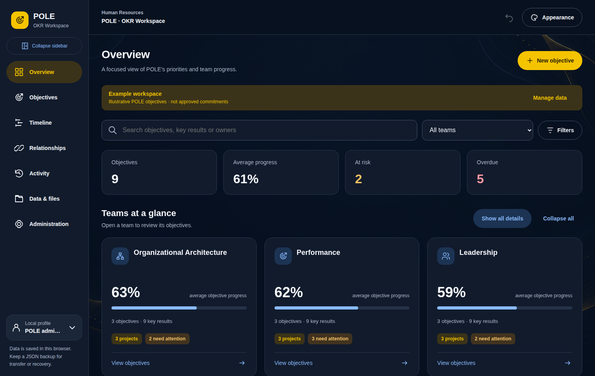

# POLE OKR Tracker

The POLE OKR workspace, packaged as a downloadable application with a Python
backend. The interface is the original tracker; what changed is where the data
lives. Instead of a 6.5 MB HTML file keeping everything in one browser's
`localStorage`, the workspace is a JSON document owned by a local Flask server —
so it survives a cleared cache, is backed up on every save, can be opened from
more than one browser or machine, and can be managed from a terminal.



## Install

### For everyone in the team: the portable folder

**No Python, no installer, no administrator rights.** Download
`OKR-Tracker-Portable.zip`, unzip it, double-click **OKR Tracker.bat**. Your
browser opens on the tracker.

Get the zip from the **Actions** tab of this repository: open the most recent
*Build portable Windows app* run and download it from **Artifacts** at the
bottom. Tagged releases carry it as a release asset too.

The folder contains a complete, self-contained python.org runtime, so nothing
is installed and nothing is added to PATH. Every binary in it is a signed
python.org file rather than a custom-built executable, which matters where IT
blocks unknown `.exe` files.

### Sharing one workspace with the team

Unzip the folder onto your shared drive and have everyone run it from there.
The bundled `okr-tracker.ini` keeps the data inside the folder, so **everyone
sees and edits the same OKRs** with nothing to configure.

Simultaneous edits are safe. Saves are serialised with a lock file that holds
across machines, and a save that loses a race is reported in the app rather
than quietly overwriting someone else's work. Each browser rechecks for other
people's changes every 15 seconds.

To give each person a private workspace instead, comment out the `data_dir`
line in `okr-tracker.ini`.

> **A note on the network drive.** Running directly from a share works, but
> starts more slowly than from a local disk, and some antivirus policies block
> `.bat` files on network drives. If a double-click does nothing, copy the
> folder to the desktop and run it from there — or use the shared-host setup
> below instead.

### For a team that would rather not copy anything

Run the tracker on one always-on PC with `--host 0.0.0.0 --passphrase "…"` and
send everyone the link. Nobody downloads anything at all; they just open a
browser. See [Sharing a workspace](#sharing-a-workspace).

### From source

If you already have **Python 3.9+**, the repository runs directly and installs
what it needs on first run:

```bash
python run.py                  # builds a private .venv, then serves
make run                       # the same, via make
uv run run.py                  # uv handles the dependencies itself
pip install .                  # installs an `okr-tracker` command
```

On Windows, `Start OKR Tracker.bat` does this by double-click; on macOS,
`Start OKR Tracker.command`; on Linux, `./start.sh`.

Managing dependencies yourself? `OKR_NO_BOOTSTRAP=1` stops it touching a
virtual environment:

```bash
python -m pip install -r requirements.txt
OKR_NO_BOOTSTRAP=1 python run.py
```

### Building the portable folder yourself

```bash
python tools/build_portable.py            # any OS with a network connection
python tools/build_portable.py --python-version 3.12.7
```

It downloads the embeddable Python, installs the two dependencies, and writes
`dist/OKR-Tracker-Portable(.zip)`. GitHub Actions runs the same script on
Windows, starts the bundled app and checks it serves before publishing.

## Settings

A portable copy reads `okr-tracker.ini` from its own folder, so a shared
deployment carries its configuration with it. Relative paths are measured from
that folder:

```ini
[tracker]
data_dir = data      ; one shared workspace inside the folder
host = 127.0.0.1
port = 8765
poll_seconds = 15
backup_count = 30
; read_only = true
```

Environment variables (`OKR_DATA_DIR`, `OKR_PORT`, …) override the file, and
command line flags override both.

## Where your data goes

| What | Where |
| --- | --- |
| Workspace | `<data dir>/workspace.json` |
| Backups | `<data dir>/backups/` (the last 30 saves) |
| Session key | `<data dir>/secret.key` |

In a portable copy `<data dir>` is the `data` folder inside it. Otherwise it
follows each platform's convention — `~/.local/share/pole-okr-tracker`
on Linux, `~/Library/Application Support/pole-okr-tracker` on macOS,
`%APPDATA%\pole-okr-tracker` on Windows. `python -m okr_tracker where` prints the
exact paths and a summary of what is stored. Override it with `--data-dir` or
`OKR_DATA_DIR` — pointing it at a synced folder is a reasonable way to carry a
workspace between machines.

The data directory is deliberately outside the application, so upgrading or
replacing the app never touches a workspace.

## Command line

```bash
python -m okr_tracker                    # serve (same as run.py)
python -m okr_tracker where              # data locations and workspace summary
python -m okr_tracker profiles           # profiles and whether passwords are still initial
python -m okr_tracker export backup.json # write the workspace out
python -m okr_tracker import backup.json # replace it (the outgoing one is backed up)
python -m okr_tracker reset-password --profile "POLE administrator"
```

`reset-password` exists because profile passwords are hashed inside the
workspace document; if the administrator password is lost there is otherwise no
way back in. It writes the same PBKDF2-SHA256 block the browser writes, which
the end-to-end tests verify by signing in with a password only Python has seen.

### Serving options

```bash
python run.py --port 9000
python run.py --no-browser
python run.py --read-only                      # serve a workspace nobody can change
python run.py --host 0.0.0.0 --passphrase "…"  # share it on your network
```

Every flag has an environment variable: `OKR_HOST`, `OKR_PORT`, `OKR_DATA_DIR`,
`OKR_READ_ONLY`, `OKR_PASSPHRASE`, `OKR_POLL_SECONDS`, `OKR_BACKUP_COUNT`,
`OKR_SECRET_KEY`.

## Sharing a workspace

Bind to a reachable interface and set a passphrase:

```bash
python run.py --host 0.0.0.0 --passphrase "something long"
```

Everyone who opens the address gets the same workspace. Concurrent edits are
safe: each save carries the revision it was based on, and the server refuses one
built on a revision it has moved past. The losing browser picks up the winning
document and shows the tracker's own "someone else saved newer data" notice
rather than overwriting the change. Browsers also poll every 15 seconds
(`OKR_POLL_SECONDS`, `0` disables it) so a second tab notices edits without a
reload.

**Understand the trust model before you do this.** The passphrase is a real
boundary — without it nothing is served. The *in-app* roles (admin, editor,
viewer) are not: they are enforced in the browser, and the API accepts any valid
workspace from anyone past the passphrase. That is fine for a team that trusts
each other and wants an audit trail of who changed what; it is not a substitute
for per-user server accounts. Run it on a trusted network, and use
`--read-only` when you only want to publish a view.

## HTTP API

All routes are JSON, on the same origin as the app.

| Route | Purpose |
| --- | --- |
| `GET /api/health` | server state and workspace summary |
| `GET /api/workspace` | `{document, revision}`; `document` is `null` before first use |
| `PUT /api/workspace` | `{document, baseRevision}` → `200`, or `409` with the current document |
| `GET /api/workspace/export` | download the workspace as a JSON file |
| `POST /api/workspace/import` | replace the workspace wholesale |
| `GET /api/backups` | retained backups, newest first |

A `PUT` whose `baseRevision` does not match what is stored writes nothing and
returns `409` together with the document that won, which is exactly what the
browser needs to resynchronise.

## How it fits together

The tracker's storage calls are synchronous — `load()` runs during the first
paint and `persist()` expects an answer immediately — so the backend is reached
through a shim rather than by rewriting the application:

```
okr_tracker/static/js/app.js          the original tracker, logic untouched
       │  localStorage.getItem/setItem  →  okrStore.getItem/setItem
       ▼
okr_tracker/static/js/backend-store.js  in-memory mirror + background sync
       │  GET/PUT /api/workspace
       ▼
okr_tracker/api.py → storage.py         compare-and-swap, atomic write, backup
       ▼
<data dir>/workspace.json
```

The shim keeps a mirror of the document so reads answer instantly, seeded by the
server into the page itself (so the very first `load()` has real data, with no
round trip). Writes update the mirror and go to the server in a serialised
queue. When the server rejects a write, or a poll finds a newer revision, the
shim adopts the server's document and fires a `storage` event — the same signal
the tracker already listens for to handle a second browser tab. Conflicts
between two users therefore take a code path the application already had.

`tools/build_frontend.py` is the build step. It splits the single-file HTML into
`static/css/app.css`, `static/js/app.js`, three artwork PNGs and a template;
redirects the 12 `localStorage` call sites to `okrStore`; and corrects the five
interface strings that claimed data lives in the browser. Re-run it after
dropping a newer tracker build into `vendor/`:

```bash
python tools/build_frontend.py
```

Pulling the artwork out of the HTML is also what makes the app quick to load.
Against the original 6.5 MB single file, a page load now costs ~310 KB of HTML,
CSS and JavaScript plus the workspace itself; the 4.7 MB of PNGs are separate
files, so the browser caches them and fetches only the one the current theme
uses.

## Building a standalone executable

For people who should not have to install Python at all:

```bash
make app          # or, by hand:
python -m pip install -r requirements.txt pyinstaller
python -m PyInstaller packaging/okr-tracker.spec
```

`dist/okr-tracker` (`.exe` on Windows) is a single file that runs the server and
opens the browser. PyInstaller does not cross-compile, so build on the platform
you are shipping to. Workspaces still live in the user's data directory, so the
executable can be replaced freely.

## Tests

```bash
python tests/run_all.py
```

36 backend tests cover the store's compare-and-swap, atomic writes, backup
retention, concurrent writers, schema validation, the API, read-only mode and
the passphrase gate. 10 more cover the first-run installer, and 22 cover the
portable deployment: the ini file's precedence, the cross-machine lock under
eight competing processes, running with no console at all, and that the
assembled bundle really resolves its data into its own folder.

The installer's one live test actually builds an environment from a Python with
no Flask, and is skipped by default because it needs the network:

```bash
OKR_TEST_BOOTSTRAP=1 python tests/run_all.py
```

10 end-to-end tests drive the real application in Chromium against a real
server: first-run seeding, reload, a UI-driven sign-in and edit reaching disk, a
rejected stale write, a burst of rapid writes, recovery after the server becomes
unreachable, read-only refusal, and the Python/WebCrypto password compatibility
described above. They need Playwright and skip themselves cleanly when it is
unavailable:

```bash
python -m pip install playwright && python -m playwright install chromium
```

## Layout

```
Start OKR Tracker.bat      double-click launcher (Windows)
Start OKR Tracker.command  double-click launcher (macOS)
start.sh                   launcher (Linux, and what the macOS one calls)
run.py                     the launcher proper: installs on first run, then serves
Makefile                   make run / install / test / build / app
requirements.txt
pyproject.toml             installs an `okr-tracker` command
okr_tracker/
  __main__.py              CLI: serve, where, profiles, export, import, reset-password
  app.py                   Flask factory, page route, passphrase gate
  api.py                   JSON API
  storage.py               atomic JSON document store with backups
  schema.py                structural validation
  auth.py                  PBKDF2 (browser-compatible) and the server gate
  bootstrap.py             first-run virtual environment and dependency install
  config.py                settings: okr-tracker.ini, environment, defaults
  filelock.py              cross-machine lock for a workspace on a shared drive
  headless.py              logging and error reporting when there is no console
  static/, templates/      built by tools/build_frontend.py
tools/build_frontend.py    splits the single-file HTML into static assets
tools/build_portable.py    assembles the no-install Windows folder
.github/workflows/         tests, and the portable build
packaging/okr-tracker.spec PyInstaller spec
vendor/                    the original single-file HTML, kept as the build input
tests/
```
